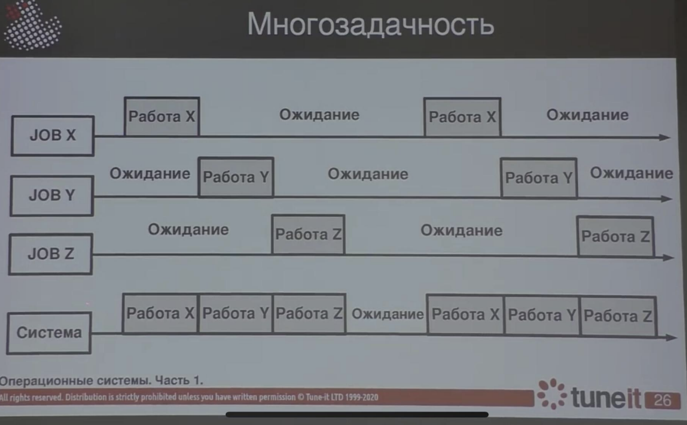

## 1. Анализ общесистемной эффективности как предусловие многозадачности

**Общесистемная эффективность** — это способность системы достигать поставленных целей с минимальными затратами ресурсов (времени, энергии, вычислительных мощностей и пр.).  

---

## 2. Многозадачность как способ повышения системной эффективности

**Многозадачность** — это свойство системы выполнять (или создавать видимость выполнения) несколько задач одновременно.  
Выделяют два основных подхода к многозадачности:

- **Псевдопараллелизм (кооперативная или вытесняющая многозадачность):** процессор быстро переключается между задачами, создавая видимость параллелизма.
- **Истинная параллельность:** одновременное выполнение задач на разных ядрах или процессорах.

---

## 3. Системы разделения времени (time-sharing systems)

**Системы разделения времени** — класс операционных систем, рассчитанных на одновременную работу множества пользователей, где каждый ощущает, что система работает только на него.

### Принципы работы:
- Каждому пользователю (или процессу) выделяется небольшой квант времени;
- После окончания кванта управление передается следующему процессу;
- Быстрое чередование процессов создает эффект одновременности.

### Преимущества:
- Повышение эффективности использования ресурсов;
- Уменьшение времени отклика для каждого пользователя;
- Поддержка большого числа интерактивных сессий.

