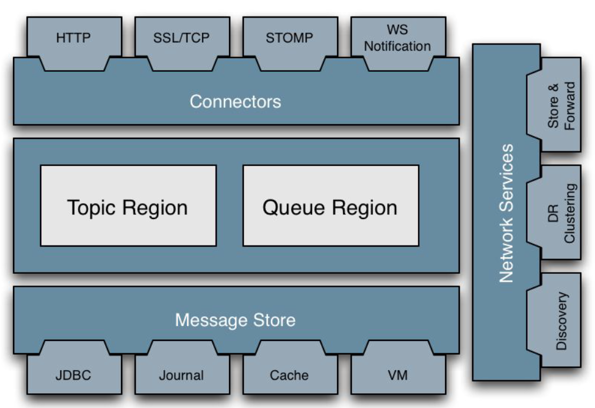

## Active MQ

**ActiveMQ** - популярный open-source сервис обмена сообщениями от Apache, построенный на основе Java. Он работает как ориентированное на сообщения промежуточное программное обеспечение. Полностью совместим со спецификацией JMS. Поддерживает протоколы OpenWire (дефолтный), AMQP, STOMP и MQTT. До систем обмена сообщениями, как ActiveMQ, было трудно - если не невозможно - "федерировать" приложения, которые:
* Были написаны на разных языках.
* Проживают на гетерогенных платформах.
* Использовались различные структуры данных и протоколы. поддерживает различные протоколы поверх веб-сокетов, что обеспечивает полнодуплексный обмен данными.

### Область применения 
ActiveMQ используется в качестве моста связи между несколькими компонентами, которые могут быть размещены на отдельных серверах или могут быть записаны на разных языках программирования. Брокера сообщений можно встретить в корпоративных системах - или любых системах, которые имеют сложную архитектуру, например в финансовой и банковской промышленности, где важна надежная система с высокой доступностью.

## Архитектура

### Плюсы
* Высокая доступность, основанная на архитектуре ведущий-ведомый
* Надежность - низкая вероятность потери данных

### Минусы 
* Пропускная способность на порядок ниже, чем у Kafka
* Более тяжеловесный, чем RabbitMQ

## Open Wire
**OpenWire** — собственный бинарный протокол Apache ActiveMQ (версии 4.x и выше) прикладного уровня, разработанный для обеспечения высокопроизводительного кроссплатформенного обмена сообщениями. В отличие от текстовых протоколов (STOMP) или стандартов общего назначения (AMQP), OpenWire создавался как "родной" язык общения между ActiveMQ и его клиентами, обеспечивая максимальную производительность и доступ к расширенным возможностям брокера. Работает поверх TCP/IP, все данные передаются в big-endian порядке.

### Особенности
* Бинарный формат - компактен, значительно экономит трафик
* Командно-ориентированный протокол - клиент и брокер обмениваются объектами `Command`, которая содержит поле type (ConnectionInfo, SessionInfo)
* Динамическое согласование возможностей через команду WireFormatInfo 
* Определяет десятки типов команд: управляющих, транзакционных, сообщения и служебные

### Реализации для различных платформ
Существует единый генератор на Java, автоматически создающий клиентские библиотеки для разных языков под единый API, гарантируя идентичность поведения. Для различных яп существуют свои реализации:
* Java - встроен в ActiveMQ Classic, стандарт для JMS-приложений
* С# - ActiveMQ NMS Client, исползьуется для .NET приложений
* С++ - CMS OpenWire, для высоконагруженных C++ приложений в финансах, играх, embedded системах
* Python/Ruby/Perl - библиотеки OpenWire