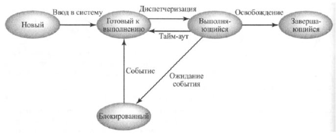

## Состояния процесса

Обычно процесс в ОС может находиться в одном из следующих состояний:

1. **Новый:**  
    Только что созданный процесс, который еще не помеещн ос в пул выполнимых процессов.
2. **Готов к выполнению:**  
   Процесс, который может быть запущен, как только для этого представится возможность.
3. **Выполняющийся**  
   Процесс, который выполняется в текущий момент времени.
4. **Блокированный**  
   Процесс ,который не может выоплняться до тех порпока не произойдет некоторое событие, напимер завершение io.
5. **Заверщающийся**  
   Процесс, удаленный ос из пула выполнимых процессов из-за завершения работы или ошибки.

