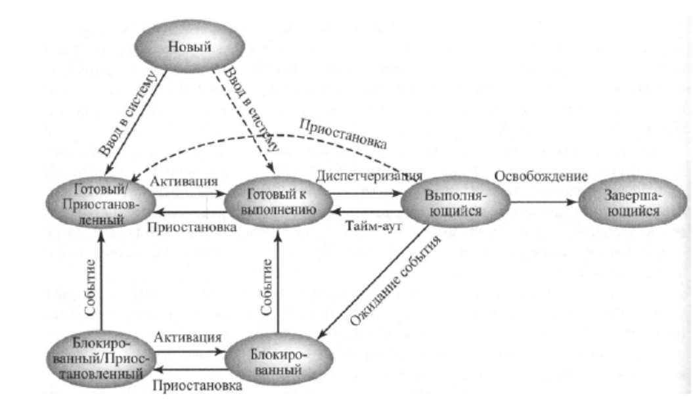

## Paging и Swapping

### Paging (Страничная организация памяти)

- **Paging** — это механизм управления памятью, при котором вся память процесса разбивается на одинаковые по размеру страницы.
- Каждая страница может быть размещена в любой физической области оперативной памяти.
- Если процессу требуется больше памяти, чем доступно в ОЗУ, отдельные страницы могут быть временно выгружены на диск (в файл подкачки).
- Основная цель paging — эффективное использование памяти и изоляция процессов.

### Swapping (Выгрузка/подкачка процессов)

- **Swapping** — это механизм, при котором целиком процессы (или их существенная часть) временно выгружаются из оперативной памяти на диск (обычно в область подкачки), чтобы освободить память для других процессов.
- Когда выгруженному процессу снова необходимо выполняться, его загружают обратно в оперативную память.
- Недостаток swapping по сравнению с paging: перемещение всего процесса требует больше времени и ресурсов, может приводить к большему временному простою.

---

## Модель процесса с семью состояниями

В расширенной модели жизненного цикла процесса выделяют 7 основных состояний:

1. **Новый (New)**  
   Процесс только что создан и находится в стадии инициализации.

2. **Готовый/Приостановленный**  
   Процесс готов к выполнению, но по каким-то причинам находится вне основной памяти (например, выгружен на диск из-за недостатка ОЗУ).

3. **Готовый к выполнению**  
   Процесс находится в памяти, готов к запуску, ожидает выделения процессора.

4. **Выполняющийся**  
   Процесс занимает процессор и выполняет свои инструкции.

5. **Блокированный**  
   Процесс ожидает наступления какогo-либо события (например, завершения операции ввода-вывода).

6. **Блокированный/Приостановленный**  
   Процесс находится в состоянии ожидания события, но его память выгружена (swapped) — он не в ОЗУ.

7. **Завершающийся**  
   Процесс завершил выполнение, освобождает ресурсы.

