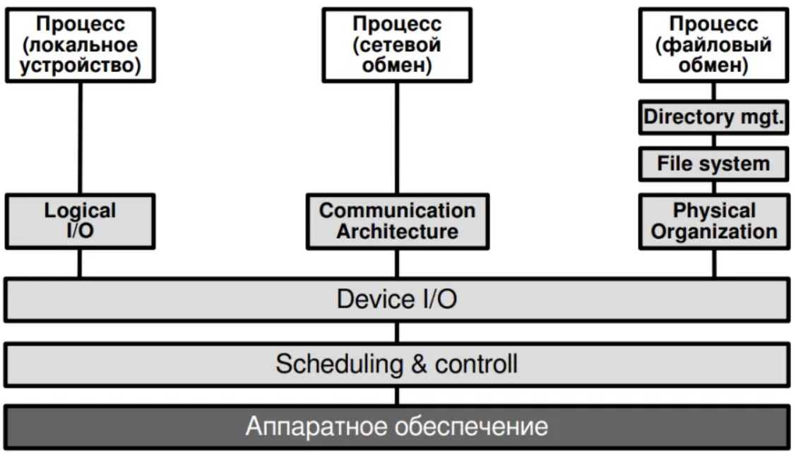

## Устройства IO
* **Пользовательские** - устройства, с которыми взаимодействует пользователь, обычно обладают похожими хар-ками
* **Внутренние** - находятся внутри компьтера. В основном подключаются драйверами, поставляемыми в комплекте с ОС или встроенными в ярдо. ОС должна иметь полный набор необходимых драйверов, иначе застравить работать устройство IO без драйвера не получится
* **Связи** - модемы, устройства Ethernet, скорости информационного обемера эти устройств могут разниться

### Характеристики
* Скорость
* Особенности использования
* Сложность управления
* Единица передачи
* Представление данных 
* Обработка ошибок

## Развитие  IO
* **Программируемый IO** - процессор непосредственно управляет периферийным устройством через его шину и регистры или контроллер, которые подключаются к шине и имеет набор управляющих регистров
* IO с использованием **прерываний** - добавляются прерывания, исключающие ожидания
* **Прямой доступ к памяти (DMA)**:
  * В контроллере добавляются регистры и счетчики для обеспечения переноса области буфера в контроллере в область памяти
  * Контроллер превращается в отдельный вычислительный модуль (канал IO) с процессором и ситемой команд
  * В канал IO добавляется доп. оборудование и микропрограммы и контроллер страновится отдельным вычислительным устройст, полностью управляющий IO с группой устройств (процессор IO)  
Общая тенденция развития - отстранение процессора от затратной работы IO и делигирование работы кому-то другому

## Логическая структура IO

* **Логический IO** - обращается с устройством как с логическим ресурсом и не обращает внимания на детали фактического управления устройством, работает посредником между пользоват. процессами и устройством
* **Устройство IO** - запрошенные операции и данные конвертируются в соответствующие последовательности инструкций IO, команд управления каналом и команд контроллера, также может использ. буферизация
* **Планирование и контроль** - на уровне присходит реальная организация очередей и планирование операций IO, а также управление выполнением операций (работа с прерываниями, получение и передача информации о состоянии устройства)

