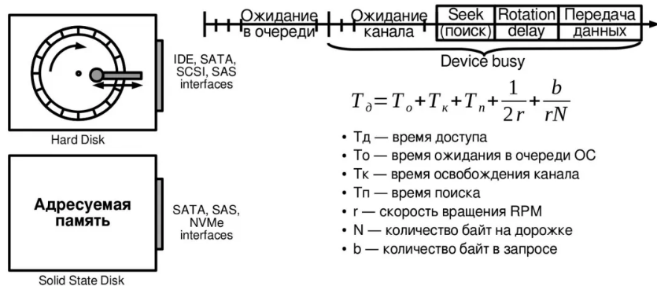

## Виды дисков
* **Диски (HDD)** - обычные жесткие диски, имеет несколько блинов, котовые вращаются со постоянной скоростью. Считывающая гловка расположена между дорожками, разбитыми на сектора. Лучше справляются с последовательным чтением, а при случайном доступе скорость падает и выгоднее использовать адресуемую память
* **SSD** - не содержат никаких двужущихся частей, внутри них в микросхемах находится адресуемая память. При использовании таких устройств не нужно ждать время оборота диска и время преемещения головки до необходимоого сектора, а брать данные прям из самого "диска" 

Полное время доступа к блоку складывается из ожидания в очереди ОС, ожидания свободного канала, времени поиска дорожки, ожидания оборота до сектора и времени передачи данных. У SSD отсутсвуют время поиска и время оборота, вместо них играет роль время доступа к адресной памяти

## Базовые алгоритмы

- **FIFO** - обслуживание в порядке поступления. Справедливо, но при большом потоке превращает в случайный доступ
- **Приоритетный** - вытаскиваем запросы от более приоритетных процессов. Для этих самых важных задач хорошо, для длинных и низкоприоритетных нагрузок… плохо
- **LIFO** - последний пришел, первый ушел. Выполняется последний пришедший запрос. Дает локальность для цепочек запросов одного процесса, но могут сильно голодать старые запросы, поэтому уместен только в специфичных случаях

Однако вся эта база не учитывает информацию о положении считывающих головок.

## Геометрические алгоритмы, учитывающие положение головки

* SSTF (shofrtest seek time first) - всегда выбираем запрос, наиболее билзкий к текущему положению головки по номеру цилиндра. Сильно уменьшает среднее перемещение, но может забыть дальние запросы
* SCAN (лифт) - головка движется в одну сторону по диску и обслуживает все запросы по пути, затем идет обратно и снова обслужиет их по пути. Страндает от неравномерности - середина проходит чаще, чем края диска. Так что есть модификации
* C-SCAN - запросы обслуживаются только при движении в одну сторону, головка быстро возращается обратно
* N-step SCAN - очередь делится на подочереди ограниченного размер, за один подход обслуживает только 1 подочередь, остальные ждут
* FSCAN - 2 очереди: 1 заморожена и обслуживается текущим проходом, вторая заполняется новыми запросами, после чего они меняются ролями
