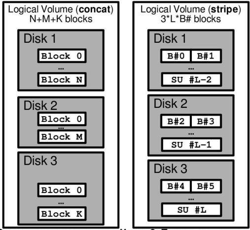
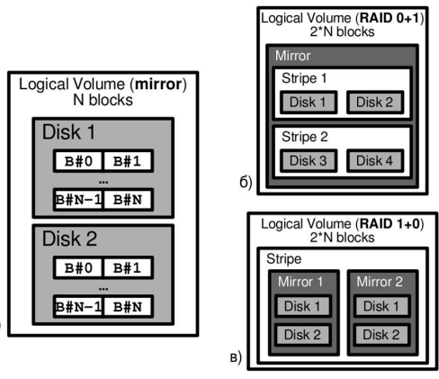

## RAID 0 - concatenation/striping 
* **Concatenation** - диски разного размера объединяются в один том больше размера -> при отказе диска данные на остальных не потеряются
* **Striping** - данные делятся на String Units (объединение блоков общим размером) и раскидываются по дискам -> при обращении к нескольким блокам велика веротность, что они на разных дисках -> повышение скорости IO, но риск потерять большие данные, распределенными по несокольким дискам
* Используется, когда производительность, емкость и малая стоимость важнее надежности

### Характеристики
* Низкая надежность (отказ 1 диска -> потеря многих данных)
* Высокая пропускная скорость передачи данных
* Выскоая скорость обработки запросов IO (для stripe)
* Отсутствие избыточности

## RAID 1 - зеркалирование
Решение проблемы надежности RAID 0 путем дублирования данных (mirroring)
Характеристики:
* Высокая надежность
* Двойная пропускная способности на чтение и одинарная на запись
* Двойная сокрость обработки запросов для чтения и одинарная на запись
Однако кол-во дисков возрастает в 2 или более раз, поэтому RAID 1 используется только для самых важных файлов

Идет также в разных конфигурациях:
* RAID 0+1 - страйпим данные по дискам, потом зеркалируем (применяем RAID 1 на RAID 0). Таким образом, группы получаются большие, при отказе диска страйп полностью теряется, надо выключать, заменять диск, собирать новый страйп и синхронизировать с зеркалом
* RAID 10 - сначала зеркалируем, потом страйпим. Группы получаются маленькие, поэтому при отказе диска валится только 1 диск, его нужно заменить и синхронизировать

RAID 1 лучше подходит для чтения и может превышать скорость RAID-0 в два раза в
среде, ориентированной на транзакции.

